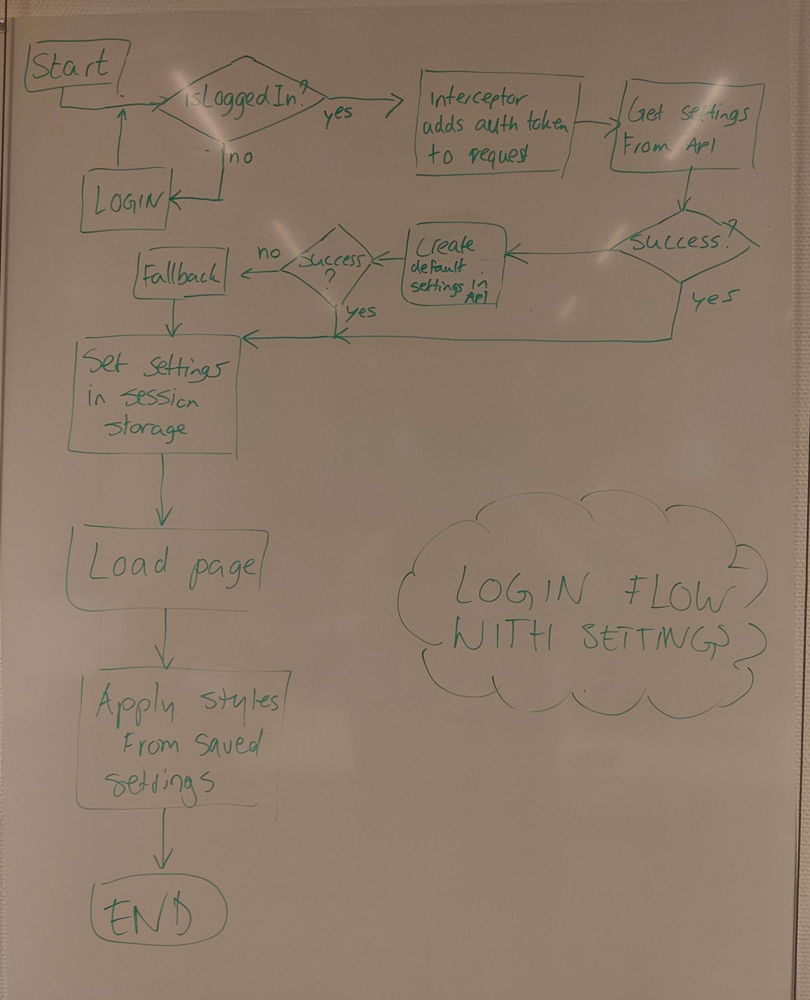
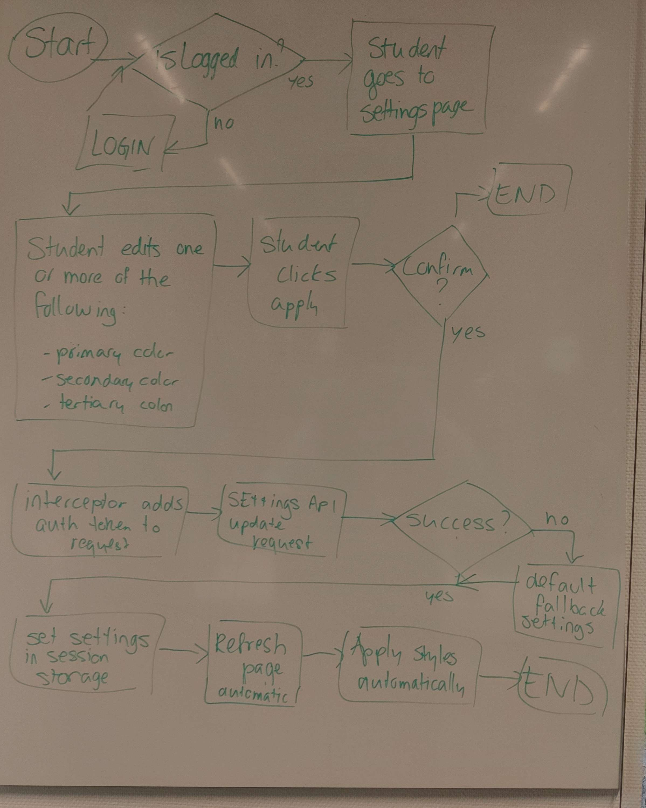
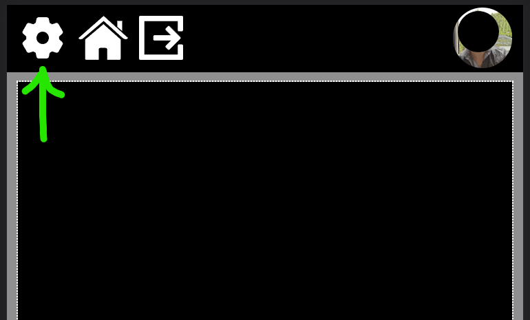
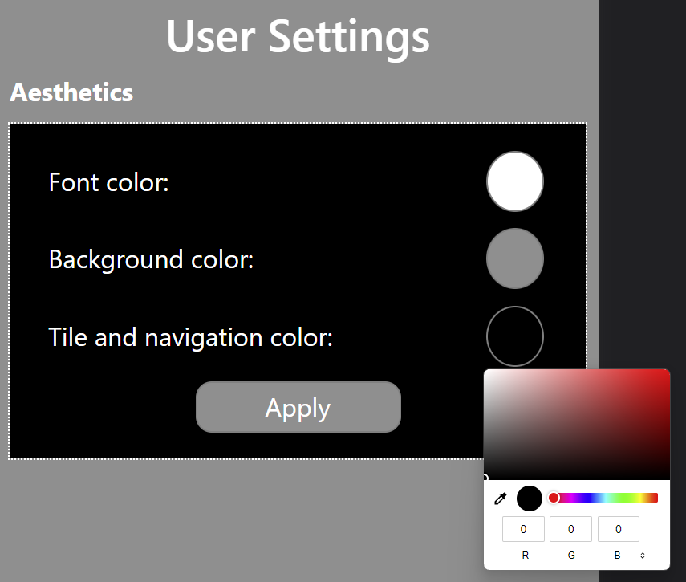
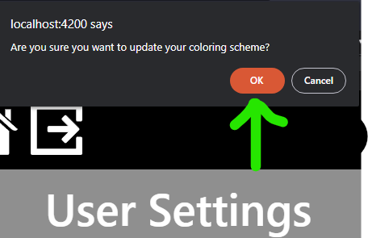

# The user flow when logging in and changing settings

- [The user flow when logging in and changing settings](#the-user-flow-when-logging-in-and-changing-settings)
  - [Intro](#intro)
  - [Flowcharts](#flowcharts)
    - [The login flow while logging in](#the-login-flow-while-logging-in)
  - [The flow of changing a user's settings manually](#the-flow-of-changing-a-users-settings-manually)
  - [Unit testing in frontend](#unit-testing-in-frontend)

## Intro

In this short document I will describe the user flow from login to changing a set of settings.

## Flowcharts

### The login flow while logging in



The user enters the webpage and is immediately redirected to the login page of Google. 

Once the user successfully logs in, the application requests the user's settings from the Settings API. 

Before the request exits the application, an interceptor will modify the request and add an authentication header with the Google ID-token.

If the Settings API returns a successful `Promise<SettingsResponse>`, it will set the `tick_settings` key in the browser's session storage to the corresponding `SettingsModel` object.

If the Settings API returns a rejection, it will then try to create a new set of settings and apply that to the API. If the API returns a successful response to that creation request, it will apply the settings to the session storage.

If everything else fails, it will default to the default settings and stop trying to call the API.

## The flow of changing a user's settings manually



Once the user is logged in, the user can go to the settings page via the application's top bar. They can click on the cogwheel.



The user is then redirected to the settings page, where they can edit their color settings.

They can edit three color settings: the font, background and tile and navigation colors.



When they are are satisfied with their choice, the user can click `Apply` and click on `Ok` on the confirmation prompt.



The application will then send a request to the Settings API with a modified authorization header. 

If the API responds with a `Promise<SettingsModel>` resolving successfully, the settings will be applied in the session storage. If not, a default set of settings will be saved. The latter will act as a fallback, as this scenario should not happen normally.

## Unit testing in frontend

Both the `Settings Tile` component and the services are extensively tested.

The settings tile component has a single important function called `apply()`. This function is called whenever the user clicks the apply button.

There are a number of flow options when the user is prompted for an apply:

1) The user clicks cancel and nothing should happen.
2) The application should set the settings to default whenever the API rejects the request.
3) The application should successfully set the settings when the API accepts the request.

```ts
apply() {
    if (confirm("Are you sure you want to update your coloring scheme?")) {
        this.settingsApi.updateSettings({
        primaryColor: this.primaryColor,
        secondaryColor: this.secondaryColor,
        tertiaryColor: this.tertiaryColor,
        locale: this.userSettings.locale,
        weatherCity: this.userSettings.weatherCity
    } as SettingsModel)
    .then((successfulResponse) => {
        this.userSettings = successfulResponse.data as SettingsModel
    })
    .catch(() => {
        this.userSettings = SettingsModelBuilder.getDefault()
    })
    .finally(() => {
        this.settingsSessionStorage.setSettings(this.userSettings);
        this.reloadPage();
    });
}}
```

These conditions are tested synchronously. This poses difficulty when testing asynchronous code, like the Settings API calls. To simulate an async environment, we use Angular's `fakeAsync` and `tick()` functionality. 

The Settings API responses are mocked to isolate the tests successfully. 

The component also uses a wrapper for the browser session storage. This wrapper is used to add, get and remove the `tick_settings` object in session storage.

The session storage class is mocked in this case, since we want to test the session storage wrapper and not the session storage itself.