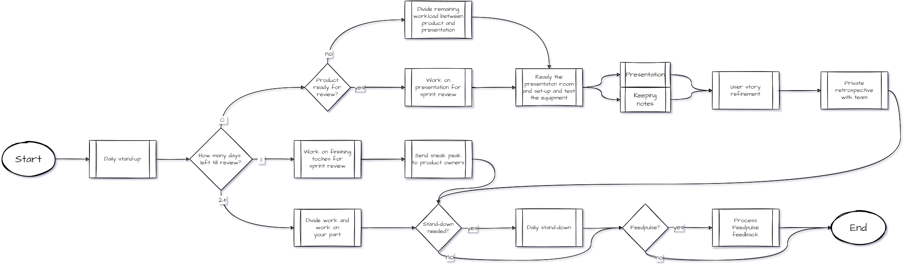

# The Agile process within our GP

- [The Agile process within our GP](#the-agile-process-within-our-gp)
  - [Intro](#intro)
  - [Business process in chart form](#business-process-in-chart-form)
  - [Explanation](#explanation)
    - [0 Days left: The Day of Reckoning](#0-days-left-the-day-of-reckoning)
    - [1 Day left: Almost there](#1-day-left-almost-there)
    - [2+ Days left: During the sprint](#2-days-left-during-the-sprint)

## Intro

This is an addendum to a previous article about Agile Methodology [here](docs/../5-agile-group-project.md).

## Business process in chart form

<small>For the full picture, [go here](images/12-business-process.png).

There are three main lanes in this business process, divided by the number of days are left till the sprint review happens.

## Explanation

### 0 Days left: The Day of Reckoning

- Start the day with the daily stand-up discussing at which point we stand within the development cycle, and what we aim to do today. The Jira board is held next to us.
- We ask ourselves, is the project ready for the upcoming review.
  -   If there is just a little bit more of touching-up to do, we divide the workload between that and making the presentation.
  -   If everything is ready, we will discuss the presentation together while making it.
  -   If nothing is ready, something has gone terribly wrong. The product owner should have already been notified prior, so that they know what happened.
- We get the necessary equipment and go to the reserved room for our presentation. We test the slides and do a test-run as if we are presenting to the product owners.
- We divide the group into two, 2 people do the presentation, while the others take notes on what gets asked or remarked.
- After the presentation, we start the refining process with the product owners.
- At the end, we have a private retrospective with the team and optionally the teacher.
- Optionally, we have a stand-down at the end of the day, discussing the day and what happened.
- Optionally, we will fill out our received feedback on Feedpulse.

### 1 Day left: Almost there

- Start the day with the daily stand-up discussing at which point we stand within the development cycle, and what we aim to do today. The Jira board is held next to us.
- We divide the remaining work and work on making the project ready for the sprint review on the next day.
- We send a sneak peak at the end of the day to the product owners. This sneak peak will say what they can expect us to present during the sprint review.
- At the end, we have a private retrospective with the team and optionally the teacher.
- Optionally, we have a stand-down at the end of the day, discussing the day and what happened.
- Optionally, we will fill out our received feedback on Feedpulse.

### 2+ Days left: During the sprint

- Start the day with the daily stand-up discussing at which point we stand within the development cycle, and what we aim to do today. The Jira board is held next to us.
- We divide our work and start working on it.
- At the end, we have a private retrospective with the team and optionally the teacher.
- Optionally, we have a stand-down at the end of the day, discussing the day and what happened.
- Optionally, we will fill out our received feedback on Feedpulse.