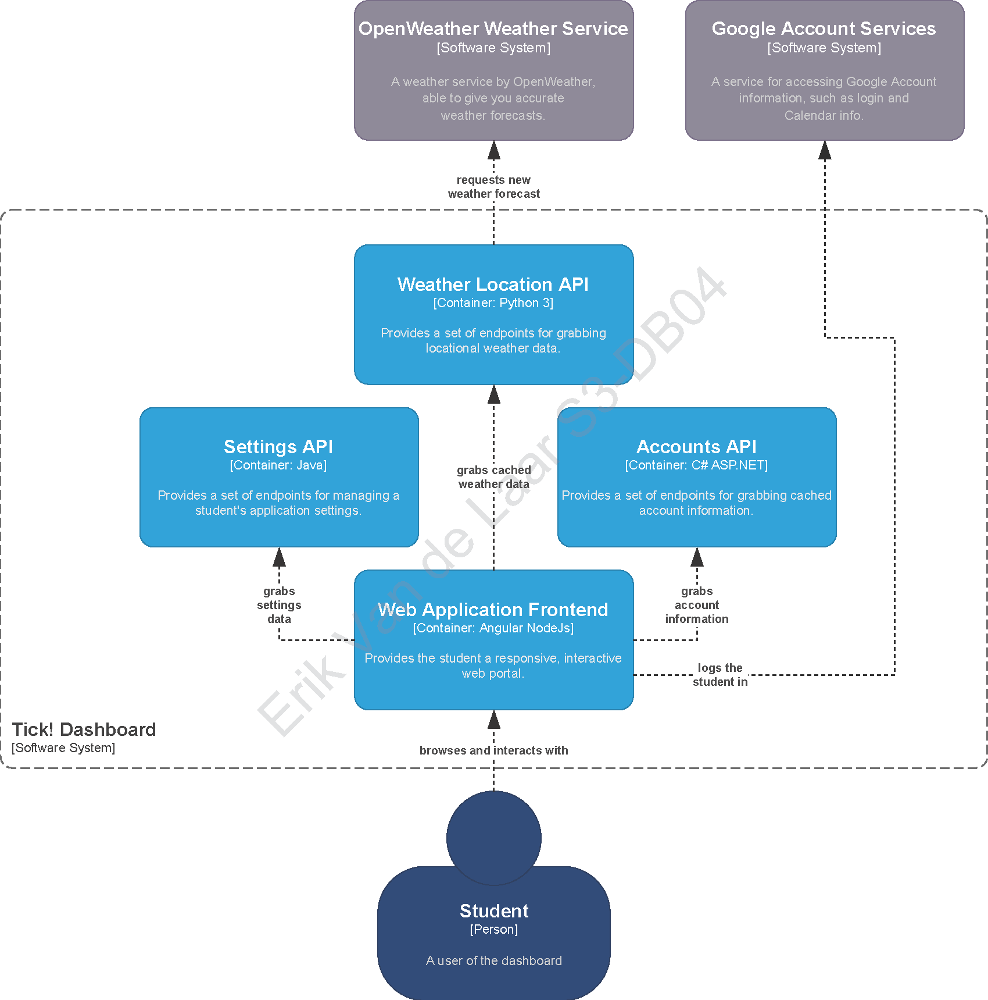

# User Stories and C4 Model

## Table of Contents

- [User Stories and C4 Model](#user-stories-and-c4-model)
  - [Table of Contents](#table-of-contents)
  - [Intro](#intro)
  - [User Stories](#user-stories)
  - [C4 Model](#c4-model)
  - [References](#references)

## Intro

At the start of the project, I had to come up with an idea, and individual user stories that come with that idea. Since this project is so open-ended, I limited myself to 4 main components:

* The frontend framework (a Javascript framework as per the requirements)
* An API to grab cached preferences and settings per user
* An API to grab cached user data linked to their Google Account
* A component to grab weather forecasts from an outside source, cache them, and return the last cached result.
  
## User Stories

With these 4 main components in mind, I started formulating the user stories.

1.  As a **student**, I want to **see the weather**.
    *  The default location is "Eindhoven, The Netherlands".
    *  The student needs to be able to change the location by typing a new one in.
    *  The student needs to be able to change the location by GPS location data. 
2.  As a **student**, I want to **see my upcoming appointments**.
    *   A quick overview of the upcoming 5 (five) appointments needs to be shown on the widget.
    *   The student can interact with each of the five appointments by clicking on it to reveal detailed information about the appointment
    *   There needs to be a shortcut to the student's Google Calendar.
3.  As a **student**, I want to **personalize my application theme**.
    *   By pressing the 'customize' icon on the dashboard, smaller customize icons should appear on each tile.
    *   By navigating the settings menu, the student should be able to select from a number of themes.
    *   The student should also be able to enter their own color, by selecting it from a color wheel or sliding bar.
    *   Both the tile color and background color should be customizable.
    *   These settings should be saved in the database, linked to the student.
5.  As a **student**, I want to **change the application language**.
    *   During the login process, the language is defaulted to English.
    *   In the settings menu, the user should be able to choose between English, Spanish, French and Chinese.
    *   The choice of language should be stored in the database, linked to the student.
6.  As a **student**, I want to want to be able to **view and change the core application settings** in a single, clear menu.
    *   On the side, there should be a settings icon to navigate to the settings menu.
    *   The student should be able to change their language preferences.
    *   The student should be able to change their theme.
    *   The student should be able to change the tile color and background color - overriding the theme settings.

*This list of user stories is not final and will be subject to change. This is a snapshot from September 19, 2022.*

## C4 Model

To visualize these core components, I made use of the C4 model. The C4 model was created as a way to help software development teams describe and communicate software architecture. I decided the visualize the second layer, the container layer.

*A screenshot of the container layer of* Tick!. *This shot was taken on September 19 2022.*

## References
[The C4 model for visualising software architecture.](https://web.archive.org/web/20220906050057/https://c4model.com/) (Archived - September 6 2022)