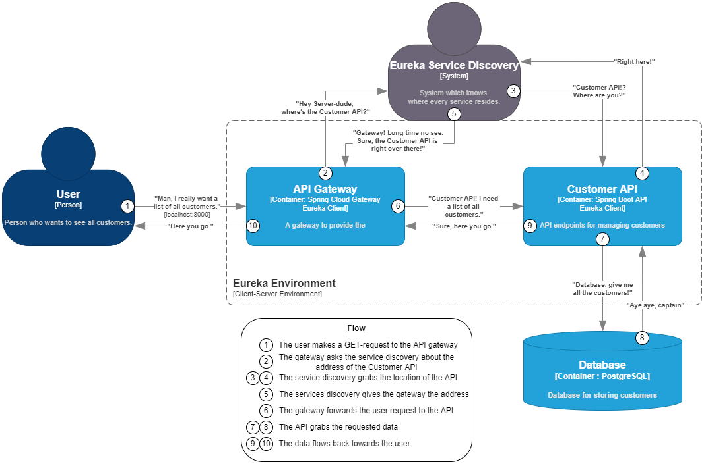
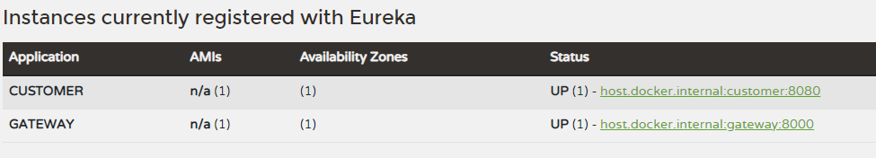
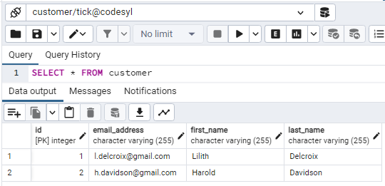
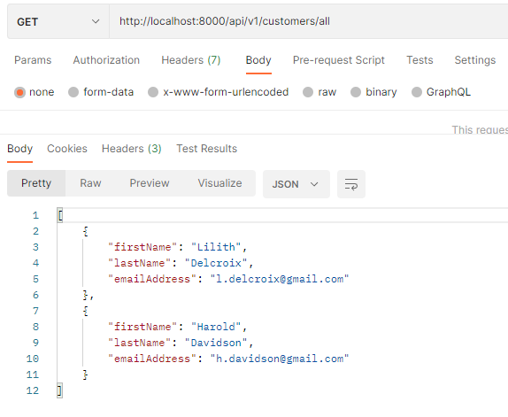

# Java microservice with Eureka support and API gateway

- [Java microservice with Eureka support and API gateway](#java-microservice-with-eureka-support-and-api-gateway)
  - [Intro](#intro)
  - [PostgreSQL database](#postgresql-database)
  - [Eureka server](#eureka-server)
  - [Customer API](#customer-api)
    - [Design](#design)
    - [Customer class](#customer-class)
    - [The controller](#the-controller)
    - [The service and repository](#the-service-and-repository)
  - [API Gateway](#api-gateway)
- [Demo](#demo)
  - [References](#references)

## Intro

*This POC's source code can be found [here](https://github.com/tick-github/poc-springboot-microservices).*

At first, when I made the architectual design of the application, the microservices would were envisioned to be in many programming languages. During my initial research after that design, I realized this would be an unrealistic approach to the creation of the app. 

I realized that it would be far easier to start with a common language, which was in this case Java. I chose Java because of the ease of use of the Netflix Eureka service discovery system. 

A crude representation of the flow of this POC is as follows:



## PostgreSQL database

This POC assumes a PostgreSQL database is running on a docker container, composed from the following docker-compose file. It contains both the database, and a user-interface for viewing the current data in the database.

```yml
services:
  postgres:
    container_name: postgres
    image: postgres
    environment:
      POSTGRES_USER: tick
      POSTGRES_PASSWORD: password #placeholder
      PGDATA: /data/postgres
    volumes:
      - postgres:/data/postgres
    ports:
      - "2345:5432"
    networks:
      - postgres
    restart: unless-stopped

  pgadmin:
    container_name: pgadmin
    image: dpage/pgadmin4
    environment:
      PGADMIN_DEFAULT_EMAIL: ${PGADMIN_DEFAULT_EMAIL:-pgadmin4@pgadmin.org}
      PGADMIN_DEFAULT_PASSWORD: ${PGADMIN_DEFAULT_PASSWORD:-admin}
      PGADMIN_CONFIG_SERVER_MODE: 'False'
    volumes:
      - pgadmin:/var/lib/pgadmin
    ports:
      - "5050:80"
    networks:
      - postgres
    restart: unless-stopped

networks:
  postgres:
    driver: bridge

volumes:
  postgres:
  pgadmin:
```

## Eureka server

The Eureka server is a Spring Boot application that acts as the service discovery 'service'. The `application.yml` file indicates it should not register with itself, because we are working with only a single Eureka server. 

```yml
eureka:
  client:
    fetch-registry: false
    register-with-eureka: false
```

The application itself is annotated with `@EnableEurekaServer` to indicate it is a server.

## Customer API

### Design

The customer API will be organized with services, repositories and controllers in mind. `Lombok` will be used to build the classes, and to handle the dependency injection. `JPA` will be used for interfacing with the database. The JPA configuration is stored in the customer API's `application.yml` file.

The application itself is annotated with the `@EnableEurekaClient` attribute, to indicate it is a client.

### Customer class

The customer class is a class consisting of an ID, a first name, a last name and an email address. The ID will be auto-generated by the database.

### The controller

The controller has the mapping `"api/v1/customer"` and has a POST-endpoint on its root to add a customer, and a GET-endpoint on `"/all"` to get all of the customers. Both endpoints forward the request to the `customerService` service, which is injected via dependency injection.

### The service and repository

The service has access to the JPA-repository via dependency injection. 

```java
private final CustomerRepository customerRepository;
```

It uses a separate `record` that acts as the `CustomerRegistrationRequest` DTO, and a separate `class` that acts as the `CustomerResponse` DTO.

```java
public List<CustomerResponse> getAllCustomers() {
    List<Customer> customers = customerRepository.findAll();
    List<CustomerResponse> response = new ArrayList<>();

    customers.forEach(
        customer ->
            response.add(
                CustomerResponse.builder()
                    .firstName(customer.getFirstName())
                    .lastName(customer.getLastName())
                    .emailAddress(customer.getEmailAddress())
                    .build()
            )
    );

    return response;
}
```

## API Gateway

The gateway is also a Eureka client. The routing is stored in its `application.yml` file and uses the Eureka client name and controller pathing to forward the requests to the right API.

```yml
server:
  port: 8000

spring:
  application:
    name: gateway
  cloud:
    gateway:
      routes:
        - id: customer
          uri: lb://CUSTOMER
          predicates:
            - Path=/api/v1/customers/**

eureka:
  client:
    service-url:
      defaultZone: http://localhost:8761/eureka
    fetch-registry: true
    register-with-eureka: true
```

# Demo

Firstly, you should run `docker compose up --build` inside the project root (where `docker-compose.yml` is located). This will start the PostgreSQL database and user interface.

Secondly, we start out by running the Eureka Server application. Following that, you should start up the API gateway and the customer API.

Once everything is running, head over to http://localhost:8761 to verify whether the services are all running. You should see these instances running: (either on `localhost` or on `host.docker.internal`)



Start up your favorite API platform. In this demo, I will be using Postman. Make two POST-requests to http://localhost:8000/api/v1/customers (the gateway address + the controller pathing for the customer API) containing two dummy customers.

```json
{
  "firstName": "Harold",
  "lastName": "Davidson",
  "emailAddress": "h.davidson@gmail.com"
}
and
{
  "firstName": "Lilith",
  "lastName": "Delcroix",
  "emailAddress": "l.delcroix@gmail.com"
}
```

You should get a status 200-OK response from both POST-requests.

In your webbrowser, go to http://localhost:5050 and login with `password` if it prompts you. Head over to `servers>..>databases>customer>schemas>public>tables` and you should see a customer table. Right click that table and select `Query Tool`. Run the query `SELECT * FROM customer`.

You will see the data we had sent to the API in our POST-requests earlier.



Go back to Postman and send a GET-request to http://localhost:8000/api/v1/customers/all. You should get a 200OK response, and the data we posted earlier:




## References

[The GitHub project](https://github.com/tick-github/poc-springboot-microservices) (September 27 2022)<br>
[Amigoscode - Course on Microservices in Java](https://www.youtube.com/watch?v=p485kUNpPvE&list=PLwvrYc43l1Mwqpf9i-1B1gXfMeHOm6DeY) (November 30 2021)<br>
[Java Techie - Spring Cloud Eureka + Gateway demonstration](https://youtu.be/vATi6Rbc06E) (March 28 2020)<br>