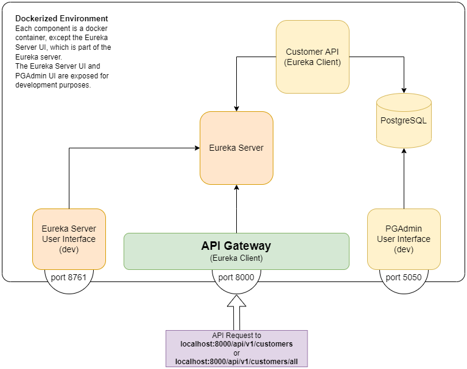
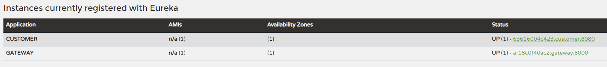
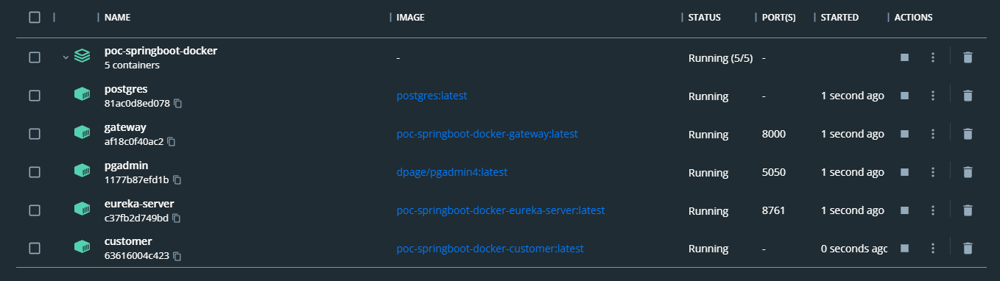

# Dockerized version of Java Customer microservices

- [Dockerized version of Java Customer microservices](#dockerized-version-of-java-customer-microservices)
  - [Intro](#intro)
  - [Main differences with non-dockerized solution](#main-differences-with-non-dockerized-solution)
  - [Starting the projects](#starting-the-projects)

## Intro

*This POC's source code can be found [here](https://github.com/tick-github/poc-springboot-docker).*

This proof of concept is a continuation of the above-mentioned POC. I wanted to experiment with dockerizing all of the microservice components. This resulted in a complete package of:

* Java Springboot Cloud Gateway
* Java Springboot Customer API
* Eureka Service Discovery
* PostgreSQL Database
* PGAdmin Database User Interface

Below is a simple representation of the package:



In the above diagram, and in the final development POC, the only exposed ports are `8000` (for the gateway), `5050` (for a visual representation of the database, dev only) and `8761` (for a visual representation of the currently running services, dev only).

## Main differences with non-dockerized solution

The main hurdle I had to overcome was decoupling the project into multiple smaller projects, each with their own stanalone configuration. Each Java project had to have a working `Dockerfile`, and the configurations had to be altered to take the docker environment into account. 

The `eureka.client.service-url.defaultZone` inside the `application.yml` in each project had to reference to the `eureka-server` container.

```yml
eureka:
  client:
    service-url:
      defaultZone: http://eureka-server:8761/eureka
```

The localhost reference in the Customer API had to be changed to reference to the `postgres` container.

```yml
server:
  port: 8080
spring:
  application:
    name: customer
  datasource:
    username: tick #placeholder
    url: jdbc:postgresql://postgres:5432/customer
    password: password #placeholder
```

## Starting the projects

In the root of [this repository](https://github.com/tick-github/poc-springboot-docker), there is a `docker-compose.yml` file. It contains the blueprint for running all of the containers. Please make sure any previous composes using this file have been shut down and cleaned by running `docker compose down` inside the root folder.

Once everything is set up, start your preferred terminal in the root of the repository and run `docker compose up --build`.

The composer should grab any dependencies it needs, this will take a moment. Once it is finished, go to http://localhost:8761 to see the Customer API and Gateway listed as being Eureka Clients.



If you head over to Docker Desktop, you should see an overview of the currently-running containers.



As you can see, the Customer API is not directly exposed. It is only reachable through the Gateway. For developmental purposes, the Eureka Server UI and PGAdmin are approachable from the host device on respectively ports `8761` and `5050`.

The Customer API currently has two endpoints which are queryable from the Gateway:

| Type | Endpoint | Expected Payload |
|:----:|:---------|:-----------------|
| `POST` | `/api/v1/customers` | ``` { "firstName": "value", "lastName": "value", "emailAddress": "value" } ``` |
| `GET` | `/api/v1/customers/all` | - |

When making a POST-request to `/api/v1/customers` you should post it to http://localhost:8000/api/v1/customers. The request will be forwarded by the Gateway to the Customer API. Any additions can be viewed by making a GET-request to `/api/v1/customers/all` with no payload, or by navigating to http://localhost:5050 and going to the `customer` table. (the latter option may have you needing to login with the `password` password)