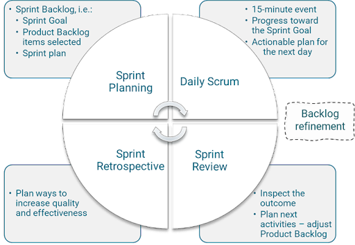
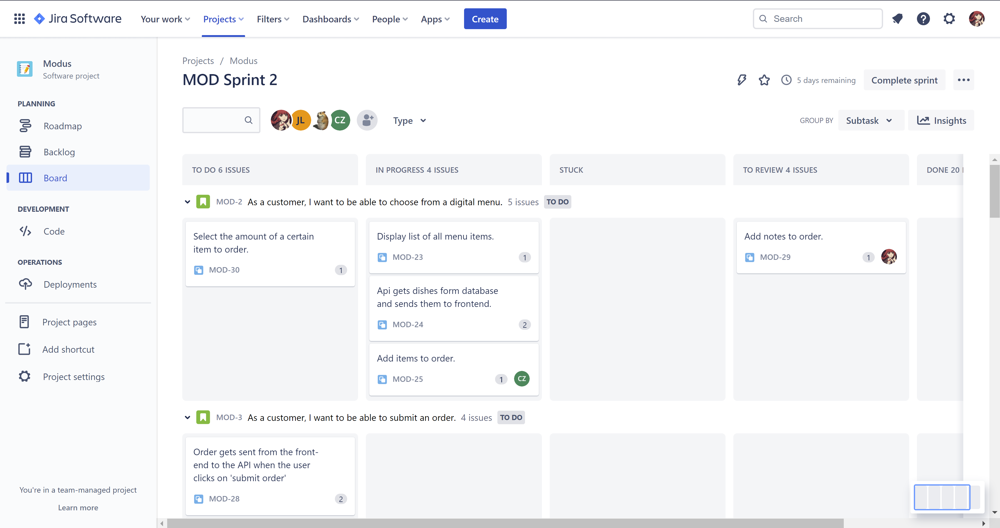

# Agile methodology in a group project

- [Agile methodology in a group project](#agile-methodology-in-a-group-project)
  - [Intro](#intro)
  - [What?](#what)
  - [Agile versus Waterfall](#agile-versus-waterfall)
  - [Scrum](#scrum)
  - [Implementation in GP](#implementation-in-gp)
    - [Tooling](#tooling)

## Intro

Agile development is a very efficient way of streamlining the work process, while allowing the addressing of customer needs during development. 

The development cycle of a project is cut up into multiple smaller mutli-week chunks, as opposed to a single giant chunk with a waterfall method. 

## What?

Agile is a modern methodology of development that breaks a larger project into smaller chunks of work. It allows the incorporation of customer feedback at every stage. The customer can then experience the product during the cycle and share their impressions and input on the go.

In short, this methodology is aimed at:

* Streamlining the development cycle
* Frequently addressing customer feedback
* Encouraging test-driven development (TDD)
* Imrpoving team collaboration

## Agile versus Waterfall

Unlike the linear Waterfall-method, Agile works with a sprint-based approach. Instead of working on one giant stretch, you break your software into smaller development cycles (sprints) that can be distributed to several project teams.

Once each cycle is finished, the product is presented to the customers for feedback. This feedback is gathered and evaluated and will be incorporated in the next sprint.

The major thing Agile wants to avoid is perfectly illustrated with the following comic:

## Scrum

## Implementation in GP

In our [group project](https://github.com/Modus-1) we make use of the Scrum framework. 

**Daily Structure**

Every day we start with a standup where we outline what every member will work on during the day. The Scrummaster updates the project board where necessary. 

**Sprint Overview**

Our project is divided in sprints of 3 to 4 weeks, which end with a sprint review and a retrospective. During the sprint review, we present our work to the stakeholders and gather their feedback. We will present them with new possible backlog items and user stories, and verify the importance of existing points. This enables us to shift our workload to another, possibly more immediate, story point. After the review, we will gather without the stakeholders and reflect on the sprint, noting any and all things that went well, and things that could be improved.

**Definition of Done**

As a group, we have defined a set of criteria which our code has to abide by to be considered 'done'. This is our Defintion of Done.

### Tooling

**Jira**

Currently (October 13 2022) we use a Jira board for managing our backlog and story points. At first we were thinking of using a Trello board, but we ultimately started using a GitHub project board. We quickly switched to Jira after having researched more. Jira is a tool used by many professional businesses, and we thought it would be more appropriate to involve it in our development.

Jira is also easy to integrate with our GitHub repository. By using `MOD-nn` as a prefix when creating a GitHub branch, Jira can automatically track its lifecycle.

**SonarCloud**

For code quality we have a SonarCloud and SonarQube integration. With every push to `main` or `develop` (you cannot push directly to these branches) the code is evaluated on code smells, duplication, test coverage, etc... We strive for minimal code smells and duplication, and a minimum of 80% code coverage on relevant code. 

