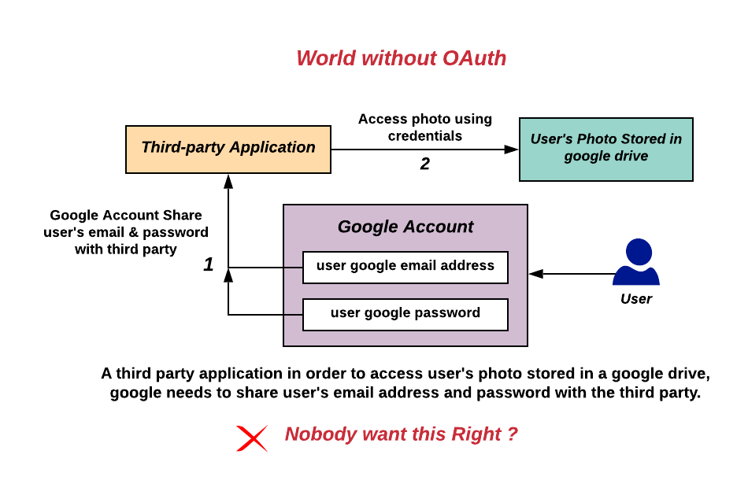

# How can I avoid storing sensitive user data?

- [How can I avoid storing sensitive user data?](#how-can-i-avoid-storing-sensitive-user-data)
  - [Intro](#intro)
  - [What is OAuth 2.0?](#what-is-oauth-20)
  - [What are tokens?](#what-are-tokens)
    - [Access Token](#access-token)
    - [Refresh Token](#refresh-token)
  - [Why use OAuth?](#why-use-oauth)
  - [The possible negatives](#the-possible-negatives)
    - [Stolen token](#stolen-token)
    - [Phishing and clickjacking](#phishing-and-clickjacking)
  - [Conclusion](#conclusion)
  - [References](#references)

## Intro

This research document will mainly focus on OAuth2, and the implementation thereof. 

A common issue in development is the storage of sensitive user data. With the many data leaks often shown in the media, you would think twice of storing someone's password on your own infrastructure. You would rather want to offload this to a reliable, trustworthy third party like Google or Microsoft.

_This research uses various methods and strategies from the DOT Framework, mainly the "library" and "workshop" methods._[[1]](#meesters-2018)

## What is OAuth 2.0?

OAuth 2.0 is an industry-standard protocol for authorization.[[2]](#oauth-def) In general, it allows third-party applications to access user information like email address, date of birth, or other required data from services like Facebook or Google, without giving the application your user password.

The OAuth mechanism works with three main components:

* **The OAuth provider**, for example Microsoft or Google, which holds the user data
* **The OAuth client**, the website or application that requires the user data
* **The owner**, this is you, the owner of the data

In a nutshell, the pattern which OAuth follows, is as follows:

1. Get the OAuth Client ID.
2. Obtain an access token from the OAuth provider.
3. Send a request with the access token, to a protected endpoint of an API.
4. Obtain a refresh token if longer access is required.

 
_The flow of an OAuth request._[[6]](#oauth-flow)

## What are tokens?

OAuth tokens are tokens that are used to make requests to a protected resource.[[3]](#oauth-accesstoken) OAuth tokens are devided into two main tokens: access tokens and refresh tokens.

### Access Token

Access tokens are credentials used to access protected resources. An access token is a string representing an authorization issued to the client. Tokens represent specific scopes and durations of access, granted by the **owner**, and enforced by the resource server and authorization server.[[4]](#oauth-accesstoken2)

Access tokens do not have to be in any particular format, and in practice, various OAuth servers have chosen many different formats for their access tokens.[[3]](#oauth-accesstoken)

### Refresh Token

Whenever an access token expires, and you need extended access, the client can use a refresh token to refresh the access token.

An OAuth Refresh Token is a string that the OAuth client can use to get a new access token without the user's interaction.[[5]](#oauth-refresh)

<pre>
  +--------+                                           +---------------+
  |        |--(A)------- Authorization Grant --------->|               |
  |        |                                           |               |
  |        |<-(B)----------- Access Token -------------|               |
  |        |               & Refresh Token             |               |
  |        |                                           |               |
  |        |                            +----------+   |               |
  |        |--(C)---- Access Token ---->|          |   |               |
  |        |                            |          |   |               |
  |        |<-(D)- Protected Resource --| Resource |   | Authorization |
  | Client |                            |  Server  |   |     Server    |
  |        |--(E)---- Access Token ---->|          |   |               |
  |        |                            |          |   |               |
  |        |<-(F)- Invalid Token Error -|          |   |               |
  |        |                            +----------+   |               |
  |        |                                           |               |
  |        |--(G)----------- Refresh Token ----------->|               |
  |        |                                           |               |
  |        |<-(H)----------- Access Token -------------|               |
  +--------+           & Optional Refresh Token        +---------------+

               Figure 2: Refreshing an Expired Access Token

   The flow illustrated in Figure 2 includes the following steps:

   (A)  The client requests an access token by authenticating with the
        authorization server and presenting an authorization grant.

   (B)  The authorization server authenticates the client and validates
        the authorization grant, and if valid, issues an access token
        and a refresh token.

   (C)  The client makes a protected resource request to the resource
        server by presenting the access token.

   (D)  The resource server validates the access token, and if valid,
        serves the request.

   (E)  Steps (C) and (D) repeat until the access token expires.  If the
        client knows the access token expired, it skips to step (G);
        otherwise, it makes another protected resource request.

   (F)  Since the access token is invalid, the resource server returns
        an invalid token error.
</pre>
_Source: Proposal of implementation of OAuth Standard._[[7]](#oauth-refresh2)

## Why use OAuth?

 
_A hypothetical authorization flow where login information is shared with a third-party application. This poses many security risks which can be prevented by the use of OAuth authorization flows._[[8]](#oauth-wiki-no)

 
_A high-level overview of Oauth 2.0 flow. The resource owner credentials are used only on the authorization server, but not on the client (e.g. the third-party app)._[[9]](#oauth-wiki-yes)

## The possible negatives

### Stolen token

An attacker could theoretically steal the access token if it is not stored correctly. This can be mitigated partially by using an access token with a short lifetime. 

### Phishing and clickjacking

As with all web-based solutions, phishing and clickjacking can become a problem. This is however not directly a problem of the developer.

## Conclusion

Nobody wants to unnecessarily store sensitive user data. In this day and age, we need to comply with local privacy laws, and the European Union's GDPR laws. 

Therefore, we want to offload this issue to a reliable and trustworthy third party like Microsoft or Google. 

The login procedure is guided via their authentication server, and our product will receive an access token, with which we can request data from their servers. We can use the unique identifier to reference to within our systems.

OAuth is the answer in this case. Be it through access tokens, through JWTs, or another token-type.

## References

> [1]  The DOT Framework - ICT research methods. (2021, July). https://ictresearchmethods.nl/The_DOT_Framework

> [2]  OAuth 2.0 — OAuth. (n.d.). Retrieved November 7, 2022, from https://oauth.net/2/#oauth-2.0

> [3]  What is an Access Token - OAuth 2.0. (2021, October 5). https://oauth.net/2/access-tokens/

> [4]  Hardt, D. (2012, October). RFC 6749: The OAuth 2.0 Authorization Framework. https://www.rfc-editor.org/rfc/rfc6749#section-1.4

> [5]  What is a Refresh Token - OAuth 2.0. (2021, October 5). https://oauth.net/2/refresh-tokens/

> [6]  OAuth 2.0 User-Agent Flow With Implementation. (2020, November 22). ArchitectXChange. https://architectxchange.com/oauth-2-0-user-agent-flow-with-implementation/

> [7]  Hardt, D. (2012b, October). RFC 6749: The OAuth 2.0 Authorization Framework. https://www.rfc-editor.org/rfc/rfc6749#section-1.5

> [8]  Devansvd. (n.d.). OAuth: A world without OAuth. Wikipedia. Retrieved November 7, 2022, from https://en.wikipedia.org/wiki/OAuth#/media/File:Without-oauth.png

> [9]  Devansvd. (n.d.-b). OAuth: Flow. Retrieved November 7, 2022, from https://en.wikipedia.org/wiki/OAuth#/media/File:Abstract-flow.png